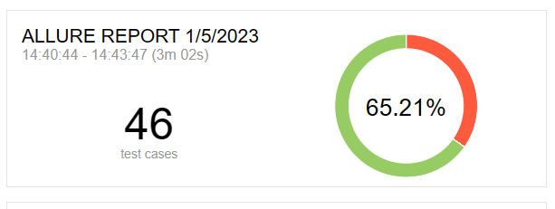
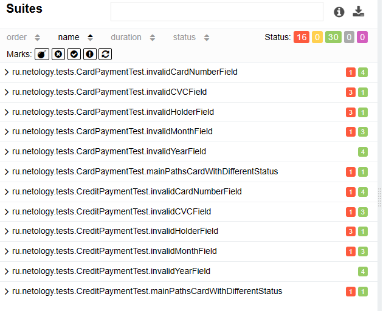

## Отчет по итогам тестирования
В соответствии с планом тестирования, в рамках дипломного проекта была проведена автоматизация тестирования 
сервисного приложения, взаимодейтсвующего с двумя СУБД и API банка.

## Отчет Allure

## Результаты автотестов
- Общее количество автотестов - 46
- Количество Passed тестов - 30 (65,21 % от общего количества)
- Количество Failed тестов - 16 (34,79 % от общего количества)
- Составлено 14 баг-репортов

## Общие рекомендации
- Составить техническое задание, которое бы в полной мере описывало схему взаимодействия с конечным пользователем,
требования ко всем элементам на странице.
- Добавить уникальные локаторы элементов страницы, для упрощения поддержки автотестов в актуальном состоянии.
- Исправить баги, отмеченные в [Issues](https://github.com/alex-pakin/diplomaqa/issues), поскольку большинство из них носит критический характер
